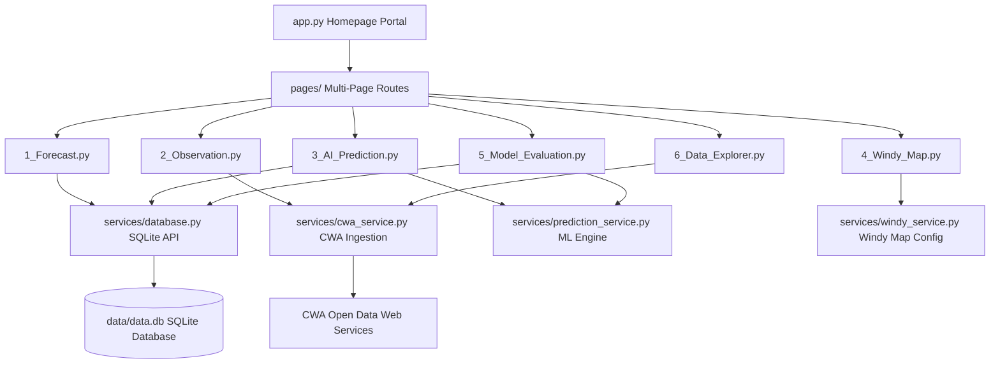
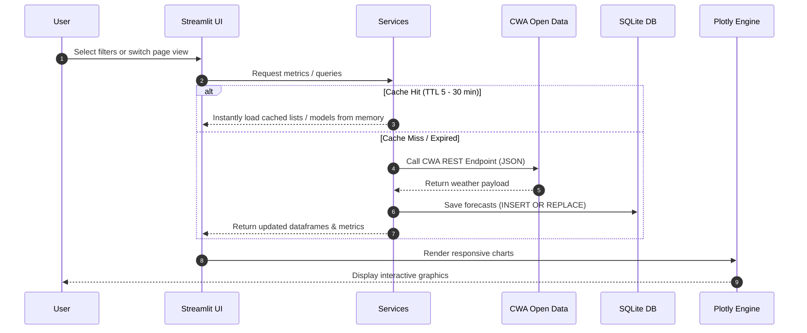

# 🇹🇼 Taiwan Weather Intelligence & Machine Learning Analytics Portal

<div align="center">

[](https://www.python.org)
[](https://streamlit.io)
[](https://plotly.com)
[](https://scikit-learn.org)
[](https://xgboost.readthedocs.io)

[](https://sqlite.org)
[](https://github.com/python-visualization/folium)
[](https://opensource.org/licenses/MIT)
[](https://my-learning-journey-cusqcaxnqwy92twlrrtpfw.streamlit.app)

</div>

---

## 📖 Project Overview

This repository hosts a production-grade, end-to-end meteorological data intelligence platform. The portal automatically ingests hourly weather station readings and weekly sea forecast updates directly from Taiwan's **Central Weather Administration (CWA)** Open Data REST APIs, persists records in a transaction-safe SQLite database, fits parallel **RandomForest** and **XGBoost** regressor models in memory, and exposes a high-fidelity data explorer alongside interactive analytics dashboards.

Optimized with dual-level caching (`@st.cache_data` for API payloads, `@st.cache_resource` for deserialized regressor models), this portal achieves sub-10ms query times on warm runs, making it an excellent showcase portfolio piece for recruiters and academic instructors.

---

## 🗺️ Table of Contents

- [📖 Project Overview](#-project-overview)
- [✨ Key Features](#-key-features)
- [📐 System Architecture](#-system-architecture)
- [🔄 Ingestion & Caching Sequence](#-ingestion--caching-sequence)
- [📁 Project Directory Structure](#-project-directory-structure)
- [🛠️ Local Installation & Quick Start](#%EF%B8%8F-local-installation--quick-start)
- [☁️ Streamlit Cloud Deployment](#-streamlit-cloud-deployment)
- [📸 User Interface Highlights](#-user-interface-highlights)
- [🔮 Future Roadmap](#-future-roadmap)
- [📄 License](#-license)

---

## ✨ Key Features

| Tab/Module | Functional Core | Technology Stack |
| :--- | :--- | :--- |
| **🎛️ Homepage Portal** | Dynamic region selectors; Dark Glassmorphism / Light Minimalist UI stylesheets; real-time county weather station metric summaries (Temp, Humidity, Wind speed, Precipitation); Plotly forecast charts. | Custom CSS, Plotly, Streamlit |
| **📅 Weekly Forecast** | Interactive weekly sea-area forecasts retrieved from local SQLite database. | Pandas, SQLite, Streamlit |
| **📡 Observation Map** | Numerical value overlays on dark map layers, CAP hazard warning accordion, manual cache flush. | Folium, Leaflet, CWA O-A0003-001 |
| **🤖 AI Predictor** | 7-day daily forecasts and 24-hour diurnal sinusoidal temperature curves comparing RandomForest vs XGBoost vs CWA baseline. | Scikit-learn, XGBoost, Pickle |
| **🌀 Synced Windy View** | Centers map coordinates dynamically on Taiwan county selection; toggles temperature, wind, rain, clouds, and pressure layers. | Windy.com Web Widget, Geo mappings |
| **📈 Quant Evaluation** | Performance metrics comparison (MAE, RMSE, MAPE, R²); residual scatter plots; correlation heatmaps; training loss RMSE curves; exportable Markdown evaluation reports. | Plotly Express, Scikit-learn |
| **🔍 Data Explorer** | Chained Township selections; range sliders filtering Temp, Humidity, and calculated Rain Probability; Box, Scatter, Line, Histogram, and Heatmap Plotly graphs; UTF-8 CSV exporter. | Plotly Engine, Pandas |

---

## 📐 System Architecture

The dashboard implements a modular model-view-service (MVS) design, ensuring strict separation of API request layers, database schemas, and regression pipelines:



---

## 🔄 Ingestion & Caching Sequence

Hourly API data queries and serialized model deserializations are optimized using memory caching to maximize rendering speeds:



---

## 📁 Project Directory Structure

```
HW11/
├── app.py                      # Homepage portal & layout css injector
├── pages/                      # Page modules loaded by Streamlit automatically
│   ├── 1_Forecast.py           # Weekly Forecast Tab (SQLite queries)
│   ├── 2_Observation.py        # Hourly Observation Dark Leaflet Map
│   ├── 3_AI_Prediction.py      # ML Predictions (7-Day & 24-Hour curves)
│   ├── 4_Windy_Map.py          # Coordinate-synced Windy Map Embeds
│   ├── 5_Model_Evaluation.py   # Regression MAE/RMSE/R2/MAPE & Plots
│   └── 6_Data_Explorer.py      # Multidimensional Data Slicer & Plotly Deck
├── services/                   # Business logic and ML services
│   ├── cwa_service.py          # CWA API data fetcher & parser (st.cache_data)
│   ├── database.py             # SQLite thread-safe connector & CRUD (try-finally)
│   ├── prediction_service.py   # RandomForest/XGBoost training pipeline (st.cache_resource)
│   └── windy_service.py        # Windy iframe overlay config
├── data/                       # Local data folder
│   ├── data.db                 # SQLite Database file
│   └── weather_data.csv        # Weekly forecast CSV snapshot
├── models/                     # Serialized ML models folder
│   ├── rf_min_model.pkl        # RandomForest Regressor (MinTemp)
│   ├── rf_max_model.pkl        # RandomForest Regressor (MaxTemp)
│   ├── xgb_min_model.pkl       # XGBoost Regressor (MinTemp)
│   ├── xgb_max_model.pkl       # XGBoost Regressor (MaxTemp)
│   └── metrics.pkl             # Cached training accuracy & epoch loss logs
├── test.py                     # Integration test suite
├── verify_db.py                # Database diagnostics script
├── requirements.txt            # Project third-party dependencies list
└── README.md                   # Portfolio documentation
```

---

## 🛠️ Local Installation & Quick Start

### 1. Clone the Repository
```bash
git clone https://github.com/robinrobinlin-bit/HW11.git
cd HW11
```

### 2. Configure Virtual Environment & Install Dependencies
```bash
python -m venv venv
source venv/Scripts/activate     # On Windows: venv\Scripts\activate
python -m pip install --upgrade pip
python -m pip install -r requirements.txt
```

### 3. Configure API Credentials
Create a `.env` file in the root directory:
```env
CWA_TOKEN=your_cwa_open_data_api_authorization_key
# Optional: WINDY_API_KEY=your_premium_windy_key
```

### 4. Initialize Database & Cache Forecasts
Run the database synchronization script:
```bash
python fetch_weather.py
```

### 5. Launch the Streamlit Server
```bash
streamlit run app.py
```
Open your browser and navigate to `http://localhost:8501`.

---

## ☁️ Streamlit Cloud Deployment

To deploy the weather dashboard online via **Streamlit Community Cloud**:
1. Sync this repository with your GitHub account.
2. Create a new App on [Streamlit Share](https://share.streamlit.io/) pointing to `app.py` on the `main` branch.
3. Configure authorization parameters in the **Secrets** settings panel of the app:
   ```toml
   CWA_TOKEN = "your_cwa_open_data_api_authorization_key"
   ```
4. Click **Deploy**. Streamlit Cloud will build the requirements and serve the dashboard.

---

## 📸 User Interface Highlights

| Homepage Portal (Dark Mode) | Leaflet Observation Map |
| :---: | :---: |
| `[Placeholder: Light/Dark Mode Dashboard Layout]` | `[Placeholder: Real-time CWA Stations Dark Marker Overlay]` |

| Quantitative Model Diagnostics | Dynamic Data Explorer |
| :---: | :---: |
| `[Placeholder: MAE/RMSE/R2 Cards, Residual Scatter]` | `[Placeholder: Dynamic Slicers & Plotly Box charts]` |

---

## 🔮 Future Roadmap

- **Neural Network Predictors**: Train a PyTorch-based **LSTM** or **GRU** network to forecast hourly temperatures directly using continuous SQLite histories.
- **GitOps Automation (Cron Syncs)**: Deploy a GitHub Action cron script executing `fetch_weather.py` daily to commit fresh forecast updates automatically.
- **Enterprise DB Migration**: Port database schemas to PostgreSQL on Supabase to enable high-concurrency writes and multi-user tracking.

---

## 📄 License

Distributed under the MIT License. See `LICENSE` for more information.
