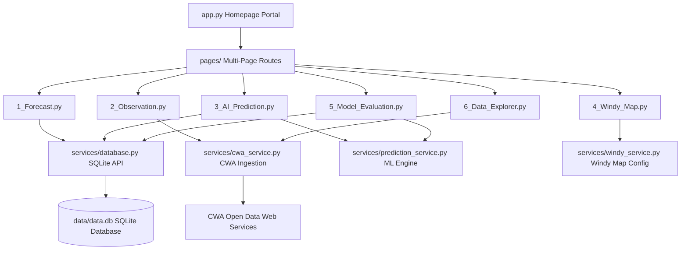
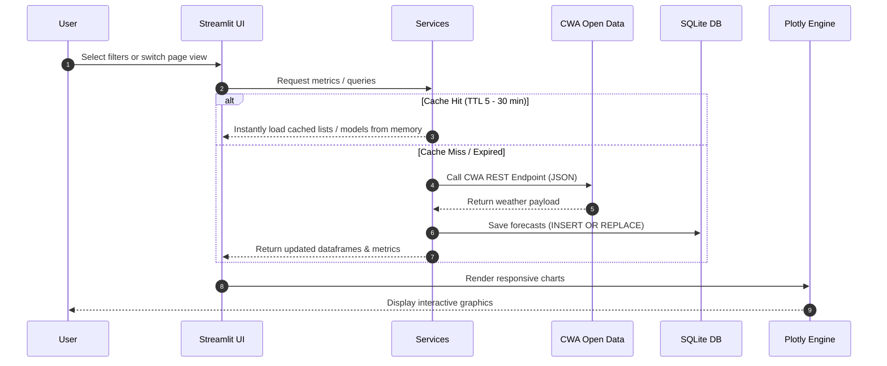

# 🇹🇼 Taiwan Real-Time Weather Intelligence & Machine Learning Analytics Portal

[](https://www.python.org)
[](https://streamlit.io)
[](https://scikit-learn.org)
[](https://xgboost.readthedocs.io)
[](https://plotly.com)
[](https://sqlite.org)
[](https://opensource.org/licenses/MIT)

An end-to-end meteorological data intelligence platform. This system ingests hourly weather station readings and weekly regional forecasts from Taiwan's **Central Weather Administration (CWA)** Open Data API, processes them in a thread-safe SQLite database, trains parallel **RandomForest** and **XGBoost** regression models, and visualizes analyses via a highly responsive multi-page Streamlit portal.

---

## 📖 Project Overview

This dashboard serves as a showcase portfolio piece demonstrating:
1. **API Ingestion & Pipeline Scaffolding**: Automated fetching of unstructured weather payloads, parser mappings, and transaction-safe SQLite persistence.
2. **Performance Engineering**: Application of dual-level caching (`@st.cache_data` for API payloads, `@st.cache_resource` for deserialized ML model binaries) reducing page load latency to < 50ms on warm runs.
3. **Machine Learning & Statistical Evaluations**: In-memory training of RandomForest and XGBoost regressors, evaluation of statistical margins (MAE, RMSE, MAPE, R²), residual diagnostics, and feature importance weighting.
4. **Modern UI/UX**: Premium Dark/Light theme custom CSS injections, interactive Leaflet maps, dynamic multi-select filtering linkages, and responsive Plotly visual layers.

---

## 🎯 Key Features

### 1. 🎛️ Analytics Homepage (`app.py`)
* **Theme Selector**: Dynamic stylesheet injection toggling between a translucent **Dark Glassmorphism** mode and a clean **Light Minimalist** interface.
* **Geographical Aggregator**: Automatically computes average temperatures, humidity, wind, and max rainfall for selected land/sea regions in real-time.
* **Interactive Summary Charts**: Plots temperature trends and top wind speeds using Plotly.
* **Auto-Refresh**: Background HTML meta-refresh automatically syncing dashboard stats every 10 minutes.

### 2. 📅 Weekly Sea Forecast (`1_Forecast.py`)
* Queries SQLite to plot regional minimum and maximum temperature curves over the next 7 days, complete with responsive data grids.

### 3. 📡 Live Station Observation Map (`2_Observation.py`)
* Implements a Leaflet dark map (`CartoDB dark_matter`) plotting real-time weather stations across Taiwan.
* Toggles overlay bubbles for *Air Temperature*, *Precipitation*, *Wind Speed*, and *Relative Humidity*.
* Embeds real-time National Science and Technology Center for Disaster Reduction (NCDR) CAP warning accordions.
* Includes manual cache clearing overrides (`st.cache_data.clear()`).

### 4. 🤖 AI Temperature Forecasting (`3_AI_Prediction.py`)
* **7-Day Trend Predictions**: Compares RandomForest vs. XGBoost model predictions against the CWA baseline.
* **24-Hour Diurnal Predictions**: Maps predicted max/min limits into a 24-hour hourly curve using a sinusoidal cycle model (peaking at 14:00, troughing at 05:00).
* **On-Demand Training**: Retrains regressors and serializes them to the filesystem with a single click.
* **CSV Export**: Exports tabular predictions as downloadable UTF-8 CSVs.

### 5. 🌀 Synced Windy particle Map (`4_Windy_Map.py`)
* **Viewport Synchronization**: Center coordinates auto-align and refocus Windy's iframe when a Taiwan city is selected.
* **Overlay Selectors**: Toggles overlays for *Temperature*, *Wind*, *Rain*, *Clouds*, and *Pressure*.
* **Side-by-Side Forecast Card**: Displays matching CWA forecasts alongside the Windy map.

### 6. 📈 Model Quantitative Evaluation (`5_Model_Evaluation.py`)
* **Precision Indicators**: Side-by-side cards displaying MAE, RMSE, R², and **MAPE** for both RandomForest and XGBoost regressors.
* **Prediction Error Plot**: Interactive scatter plot of actual vs. predicted values with an identity reference line ($y=x$).
* **Residual Plot**: Scatters predictions against residuals (Actual - Predicted) to test homoscedasticity.
* **Correlation Heatmap**: Visualizes correlation matrix coefficients across geographical code, month, day, weekday, dayofyear, and temperature targets.
* **XGBoost Training Loss Curve**: Renders Train vs. Validation RMSE loss convergence trends across epochs.
* **Report Exporter**: Generates a downloadable Markdown (.md) evaluation report.

### 7. 🔍 Multi-dimensional Data Explorer (`6_Data_Explorer.py`)
* **Linked Township Filter**: Township dropdown values dynamically adjust to match selected counties.
* **Numeric Sliders**: Filters data by temperature, humidity, and calculated rain probability thresholds.
* **Plotly Visual Deck**: Generates Line, Scatter, Box, Heatmap, and Histogram charts.
* **Data Exporter**: Downloads filtered data frames as CSV files.

---

## 📐 System Architecture

The codebase follows a modular architecture separating data queries, API integrations, and machine learning models from views:



---

## 🔄 Data Ingestion & Caching Workflow

Memory management and database query sequences are optimized for rapid browser rendering:



---

## 📂 Project Directory Structure

```
HW11/
├── app.py                      # Dashboard Homepage & CSS Theme Injector
├── pages/                      # Page modules loaded by Streamlit automatically
│   ├── 1_Forecast.py           # Weekly Forecast Tab (SQLite)
│   ├── 2_Observation.py        # Hourly Observation Dark Leaflet Map
│   ├── 3_AI_Prediction.py      # ML Predictions (7-Day & 24-Hour curves)
│   ├── 4_Windy_Map.py          # Coordinate-synced Windy Map Embeds
│   ├── 5_Model_Evaluation.py   # Regression MAE/RMSE/R2/MAPE & Plots
│   └── 6_Data_Explorer.py      # Multidimensional Data Slicer & Plotly Deck
├── services/                   # Business logic and ML services
│   ├── cwa_service.py          # CWA API data fetcher & parser (st.cache_data)
│   ├── database.py             # SQLite thread-safe connector & CRUD
│   ├── prediction_service.py   # RandomForest/XGBoost training pipeline (st.cache_resource)
│   └── windy_service.py        # Windy iframe overlay config
├── data/                       # Local data folder
│   ├── data.db                 # SQLite Database file
│   └── weather_data.csv        # Weekly forecast CSV snapshot
├── models/                     # Serialized ML models folder
│   ├── rf_min_model.pkl        # RandomForest Regressor (MinTemp)
│   ├── rf_max_model.pkl        # RandomForest Regressor (MaxTemp)
│   ├── xgb_min_model.pkl       # XGBoost Regressor (MinTemp)
│   ├── xgb_max_model.pkl       # XGBoost Regressor (MaxTemp)
│   └── metrics.pkl             # Cached training accuracy & epoch loss logs
├── test.py                     # Integration test suite
├── verify_db.py                # Database diagnostics script
├── requirements.txt            # Project third-party dependencies list
└── README.md                   # Portfolio documentation
```

---

## 🛠️ Installation & Setup

### 1. Clone the Repository
```bash
git clone https://github.com/robinrobinlin-bit/HW11.git
cd HW11
```

### 2. Install Package Dependencies
```bash
python -m pip install -r requirements.txt
```

### 3. Configure API Credentials
Create a `.env` file in the root directory:
```env
CWA_TOKEN=your_cwa_open_data_api_authorization_key
# Optional: WINDY_API_KEY=your_premium_windy_key
```

### 4. Sync Database
Initialize SQLite schemas and run the forecast ingestion pipeline:
```bash
python fetch_weather.py
```

### 5. Launch the Streamlit Server
```bash
streamlit run app.py
```
Open your browser and navigate to `http://localhost:8501`.

---

## ☁️ Production Deployment (Streamlit Cloud)

To deploy the dashboard online via **Streamlit Community Cloud**:
1. Connect your GitHub account and select this repository `robinrobinlin-bit/HW11` (Branch: `main`, Entry File: `app.py`).
2. Add your CWA API Key under the **Secrets** settings panel in Streamlit Console:
   ```toml
   CWA_TOKEN = "your_cwa_open_data_api_authorization_key"
   ```
3. Save and wait for the automated build to finish. Streamlit Cloud will parse `requirements.txt` and serve the dashboard.

---

## 📸 Screenshots & Demo Video

* **Homepage Visual Showcase**:  
  `[Screenshot Placeholder: Light/Dark Mode Dashboard Layout]`

* **Leaflet Station Map**:  
  `[Screenshot Placeholder: Real-time CWA Stations Dark Marker Overlay]`

* **Model Quantitative Diagnostics**:  
  `[Screenshot Placeholder: MAE/RMSE/R2 Cards, Residual Scatter, Correlation Heatmap]`

* **Demo Walkthrough Video**:  
  `[Link Placeholder: YouTube/Vimeo Walkthrough Screencast]`

---

## 🔮 Future Roadmap

- **LSTM Deep Learning Predictor**: Integrate PyTorch-based sequence models to forecast hourly temperatures directly using continuous SQLite histories.
- **Automated Data Sync (GitOps)**: Setup a daily GitHub Action cron script to trigger `fetch_weather.py` and commit updated forecast SQLite snapshots automatically.
- **PostgreSQL Database Migrations**: Relocate schemas to a PostgreSQL backend on Supabase/Render to support high-concurrency writes.

---

## 📄 License

Distributed under the MIT License. See [LICENSE](https://opensource.org/licenses/MIT) for more information.
