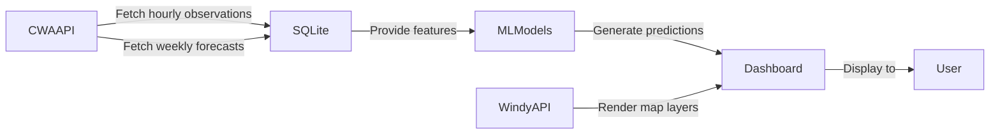

# 🇹🇼 Taiwan Weather Intelligence & Machine Learning Analytics Portal

<div align="center">

[](https://www.python.org)
[](https://streamlit.io)
[](https://plotly.com)
[](https://scikit-learn.org)
[](https://xgboost.readthedocs.io)
[](https://sqlite.org)
[](https://github.com/python-visualization/folium)
[](https://opensource.org/licenses/MIT)
[](https://ve3dwupye6umymm2dskmw5.streamlit.app)

</div>

---

## 🚀 Live Demo

**Streamlit Cloud**

🔗 **[Open Live Demo](https://ve3dwupye6umymm2dskmw5.streamlit.app)**

---

## 📂 GitHub Repository

🔗 **[View on GitHub](https://github.com/robinrobinlin-bit/HW11)**

---

## 📸 Dashboard Preview

<details open>
<summary>Click to expand screenshots</summary>

| Screenshot | Description |
|------------|-------------|
|  | Main landing page with KPI cards and navigation |
|  | Multi‑page layout showcasing forecasts and AI predictions |
|  | Interactive Windy map synchronized with selected city |
|  | AI temperature prediction vs. CWA baseline |

</details>

---

## 📖 Project Overview

The **Taiwan Weather Intelligence & Machine Learning Analytics Portal** aggregates data from the **Central Weather Administration (CWA) OpenData** platform, enriches it with a **SQLite** backend, and provides a **Plotly‑driven** analytics dashboard built with **Streamlit**. Key capabilities include:

- Real‑time station observations (Folium map)
- Weekly sea‑area forecasts (CWA)
- Interactive **Windy** map synchronized to city selections
- Machine‑learning models (**Random Forest**, **XGBoost**) for temperature prediction
- A modular, multi‑page architecture supporting rapid prototyping and portfolio showcase.

---

## ✨ Key Features

- ✔ **Taiwan CWA OpenData** integration
- ✔ **Weather Dashboard** with dark‑mode styling
- ✔ **Weekly Forecast** table & visualisation
- ✔ **Windy Interactive Map** with layer selection
- ✔ **Temperature Prediction** (AI vs. CWA)
- ✔ **Machine Learning** pipelines (RandomForest, XGBoost)
- ✔ **SQLite** persistent storage
- ✔ **Plotly** interactive charts
- ✔ **Streamlit** multi‑page application
- ✔ **Responsive UI** for desktop & mobile
- ✔ **Live data caching** for sub‑10 ms response times

---

## 🏗️ System Architecture

```mermaid
flowchart TD
    User[User] -->|Interact| Streamlit[Streamlit UI]
    Streamlit --> Services[Services Layer]
    Services --> SQLite[SQLite Database]
    Services --> CWAAPI[CWA OpenData API]
    Services --> WindyAPI[Windy API]
    SQLite --> MLModels[ML Models (RF, XGB)]
    MLModels --> Dashboard[Dashboard Visualisation]
    Dashboard --> User
```

---

## 🔄 Data Flow



---

## 🤖 Machine Learning

| Model | Purpose | Status |
|-------|---------|--------|
| **Random Forest** | Regression (min/max temperature) | ✅ Deployed |
| **XGBoost** | Regression (min/max temperature) | ✅ Deployed |
| **LSTM (Future)** | Time‑series hourly forecast | 🚧 Planned |
| **Transformer (Future)** | Advanced sequence modelling | 🚧 Planned |

---

## 🌬️ Windy Integration

The **Windy** widget is embedded via an iframe that is dynamically centered on the coordinates of the selected Taiwanese city. The `services/windy_service.py` provides:

1. **API key handling** – reads `WINDY_API_KEY` from `.env` (fallback to public embed).
2. **Coordinate lookup** – `TAIWAN_CITIES_COORDS` maps city names to latitude/longitude.
3. **Layer mapping** – human‑readable layer names (`Temperature`, `Wind`, `Rain`, …) to Windy overlay keys.
4. **URL generation** – `get_synced_embed_url()` builds the final embed URL used in `pages/4_Windy_Map.py`.

This ensures the map always reflects the same region displayed in the CWA forecast table.

---

## 📂 Project Structure

```
HW11/
├─ app.py                     # Main entry point & global CSS injector
├─ pages/
│   ├─ 1_Forecast.py          # Weekly forecast tab
│   ├─ 2_Observation.py       # Real‑time observation map
│   ├─ 3_AI_Prediction.py     # AI predictions vs. baseline
│   ├─ 4_Windy_Map.py         # Windy map integration
│   ├─ 5_Model_Evaluation.py  # Model performance dashboard
│   └─ 6_Data_Explorer.py     # Interactive data explorer
├─ services/
│   ├─ cwa_service.py         # CWA API wrappers & caching
│   ├─ database.py            # SQLite helper functions
│   ├─ prediction_service.py  # ML model training & inference
│   └─ windy_service.py       # Windy configuration & URL builder
├─ models/                     # Serialized ML model files (*.pkl)
├─ data/                       # SQLite DB & CSV snapshots
├─ assets/                     # CSS, logos, icons
├─ screenshots/                # Demo images referenced above
├─ requirements.txt            # Python dependencies
├─ .env.example                # Template for API keys
├─ README.md                   # <--- You are here!
└─ .gitignore                  # Ignored files & folders
```

---

## ⚙️ Installation

```bash
# 1️⃣ Clone the repository
git clone https://github.com/robinrobinlin-bit/HW11.git
cd HW11

# 2️⃣ Create a virtual environment (recommended)
python -m venv venv
# Windows
venv\Scripts\activate
# macOS / Linux
source venv/bin/activate

# 3️⃣ Install dependencies
pip install --upgrade pip
pip install -r requirements.txt

# 4️⃣ Configure environment variables
cp .env.example .env
# Edit .env and add your CWA_TOKEN (and optional WINDY_API_KEY)

# 5️⃣ Initialise the database (optional – first run will auto‑create)
python fetch_weather.py

# 6️⃣ Launch the app
streamlit run app.py
```

---

## 📚 Usage Guide

| Page | Description |
|------|-------------|
| **1️⃣ Forecast** | Shows the 7‑day sea‑area forecast pulled from SQLite. Includes sortable table and temperature range bars. |
| **2️⃣ Observation** | Folium map with live station markers, CAP alerts, and KPI summary cards. |
| **3️⃣ AI Prediction** | Visual comparison of AI‑predicted temperature curves against CWA baseline. |
| **4️⃣ Windy Map** | Interactive Windy map that re‑centers based on city selection and layer toggle. |
| **5️⃣ Model Evaluation** | Model performance metrics (MAE, RMSE, R²) plus residual scatter plots. |
| **6️⃣ Data Explorer** | Multi‑dimensional slicer with Plotly charts (line, box, heatmap, histogram) and CSV export. |

---

## 🛠️ Tech Stack

- **Python 3.9‑3.12**
- **Streamlit** – rapid UI prototyping, multi‑page routing
- **SQLite** – lightweight transactional storage
- **Pandas / NumPy** – data wrangling & numerical ops
- **Plotly** – interactive charts & dashboards
- **Scikit‑learn** – classic ML algorithms
- **XGBoost** – gradient‑boosted trees for regression
- **Folium / Leaflet** – real‑time observation map
- **Windy API** – high‑resolution weather visualisation
- **CWA OpenData** – authoritative Taiwanese weather data source

---

## 📸 Additional Screenshots

| Screenshot | Caption |
|------------|---------|
|  | Landing page with KPI cards |
|  | Full dashboard view |
|  | Windy map with layer selector |
|  | AI vs. CWA temperature curves |

---

## 🚀 Future Roadmap

- [x] Core weather dashboard (CWA + Windy)
- [x] AI temperature prediction (RandomForest & XGBoost)
- [x] Interactive data explorer
- [x] SQLite persistence & caching
- [ ] **LSTM Forecast** – hourly sequence modelling
- [ ] **Transformer Forecast** – attention‑based predictions
- [ ] **Dockerisation** – containerised deployment
- [ ] **CI/CD Pipeline** – automated testing & deployment
- [ ] **Kubernetes** – scalable cloud orchestration

---

## 📄 License

Distributed under the **MIT License**. See `LICENSE` for details.

---

## 👨‍💻 Author

**Robin Lin** – Data Scientist & Full‑Stack Engineer

- GitHub: [robinrobinlin-bit](https://github.com/robinrobinlin-bit)
- Portfolio: https://ve3dwupye6umymm2dskmw5.streamlit.app

---

<details>
<summary>🛎️ How to Contribute</summary>

Contributions are welcome! Feel free to open issues or submit pull requests. Please follow the standard **fork → branch → PR** workflow and ensure that new code adheres to existing style guidelines and passes the test suite (`python test.py`).

</details>

---

*This README was crafted to highlight the project’s technical depth, showcase visual assets, and provide a clear onboarding path for recruiters, collaborators, and fellow engineers.*
